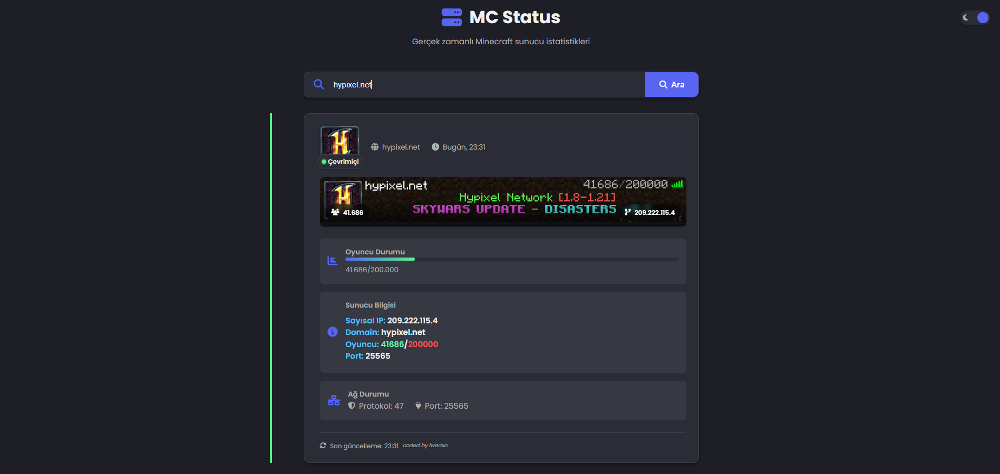

# 🎮 Minecraft Sunucu Durum Kontrol Paneli

**Gerçek zamanlı Minecraft sunucu istatistiklerini görüntülemek için gelişmiş bir web arayüzü**

## 🌟 Öne Çıkan Özellikler

- **Modern ve duyarlı tasarım** (tüm cihazlarda mükemmel görüntülenme)
- **Gerçek zamanlı sunucu durumu** (çevrimiçi/çevrimdışı kontrolü)
- **Detaylı sunucu bilgileri** (MOTD, versiyon, oyuncu sayısı)
- **Dinamik tema desteği** (açık/koyu mod)
- **Kullanıcı dostu arayüz** (kolay IP girişi ve hızlı sonuçlar)

## 🛠️ Kurulum

1. **Gereksinimler:**
   - Temel HTML/CSS/JS desteği

2. **Kurulum Adımları:**
   - `index.html`, `styles.css` ve `script.js` dosyalarını web sunucunuza yükleyin
   - Tarayıcıdan ana sayfayı açın

## 🖥️ Ekran Görüntüleri

  

## 🌐 Canlı Demo

Projeyi test etmek için: [**Canlı Bağlantı**](link)

## 🤝 Katkıda Bulunma

Katkılarınızı bekliyoruz! Lütfen önce bir konu açarak önerinizi tartışın.

1. [**Discord Sunucumuza**](https://discord.gg/sxWz2fayFa) girin.
2. Destek talebi açarak fikrinizi belirtin.

## 📜 Lisans

Bu proje [MIT Lisansı](./LICENSE) ile lisanslanmıştır.

## 📞 İletişim

Sorularınız veya geri bildirimleriniz için:

- 📧 Discord Sunucumuz: [**Tıkla**](https://discord.gg/sxWz2fayFa)
- 💬 Discord adım: **lweaxo**

---

**Not:** Bu proje Minecraft API'sini kullanır ancak Mojang veya Microsoft ile resmi bir bağlantısı yoktur.